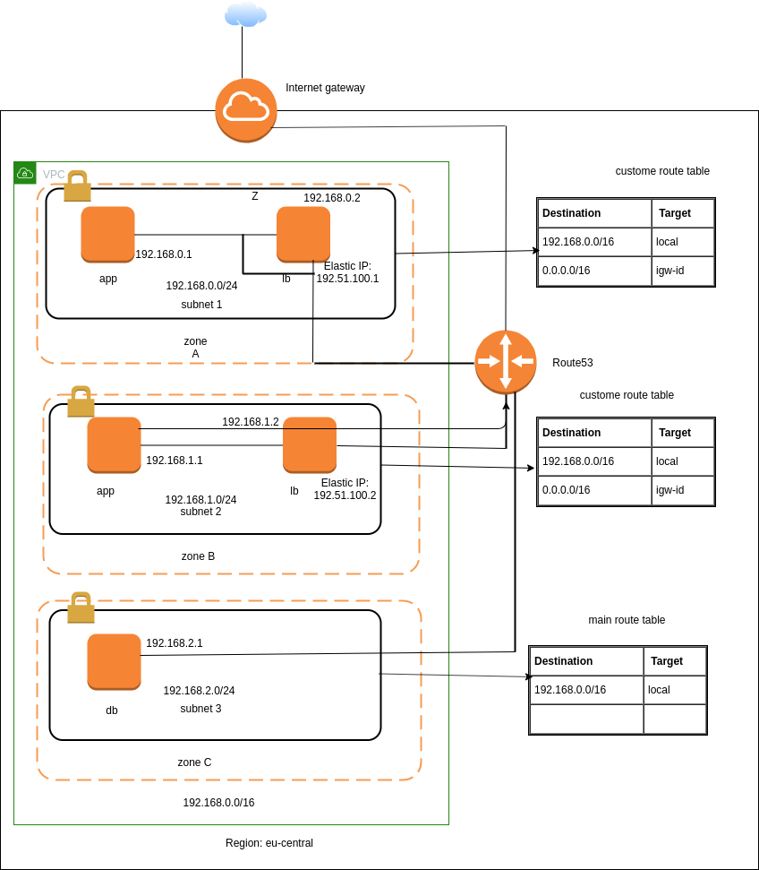

# Infrastructure(task 1)

This document will explain the architecture of the infrastructure what have been plannned. This document will cover the following topic

1. Architecture
2. Explanation of the Architechture
..* Networking
..* Nodes

## Architecture

The below figure is a protrayal of the planned infrastructure

## Explanation of the Architechture 

The complete infrastructure will build on AWS. `eu-central` has been picked as region. Here a `VPC` has been used which has three zone A, B, C. Each zone has its own subnet and they are connected through Route53. Also internet gateway has been used to access the internet. 

### Networking 

The subnet for the the complete VPC is `192.168.0.0/16`. There are three subnet in the VPC. The network block for those subnets are in below table 

| Subnet name  | Network                            |
|--------------|------------------------------------|
|subnet 1      | 192.168.0.0/24                     |
|subnet 2      | 192.168.1.0/24                     |
|subnet 3      | 192.168.2.0/24                     |

All the component which are the part of same subnet will share the same network block. And the components of multiple subnets can communicate with each other through the router. 

Only the load balancer will have the aceess to public network so we use `Elastic IP` with this nodes to have the acess in public network. 

### Nodes 

In subnet 1 and 2 there are two nodes. One node is labled as `app` where the other node is labled as `lb`. This is because the goal is to deploy the software products in `app` node and nginx is to deploy on `lb` node. The details of these nodes for subnet 1 are in below table

| Node name | EC2         | EBS volumes | IP address |Elastic IP  | 
|-----------|-------------|-------------|------------|------------|
| app       | t2.xlarge   |200 GB, SSD  |192.168.0.1 |            | 
| ĺb        | t2.medium   |100 GB, HDD  |192.168.0.2 |192.51.100.1|

The details of components for subnet 2 are

| Node name | EC2         | EBS volumes | IP address |Elastic IP  | 
|-----------|-------------|-------------|------------|------------|
| app       | t2.xlarge   |200 GB, SSD  |192.168.1.1 |            | 
| ĺb        | t2.medium   |100 GB, HDD  |192.168.1.2 |192.51.100.1|

The reason to pick the t2.xlarge for the app node as to run the software it required minimum 2.5 cores and 2 GB of RAM and for the highest performance they need 5 core and 3 GB of RAM. So this is the optimized configuration in this case. Also I took the 200 GB, SSD as EBS volume to have the modarate IO. 

For the load balancer(nginx) very high resource is not needed so t2.medium and  100 GB, HDD has been used.

The reason to have the app and lb nodes in multiple zones is high availablity. So that even if a zone go down we will have no downtime.

Subnet 3 will have the db node only where the mongodb will run. The details of this node is 

| Node name | EC2         | EBS volumes | IP address |Elastic IP  | 
|-----------|-------------|-------------|------------|------------|
| db        | t2.xlarge   |1000 GB, SSD |192.168.2.1 |            | 

This subnet is a private subnet and has no connection outside of the VPC. Also it requires fast disk so 1000 GB, SSD has been used which has very high IO. 